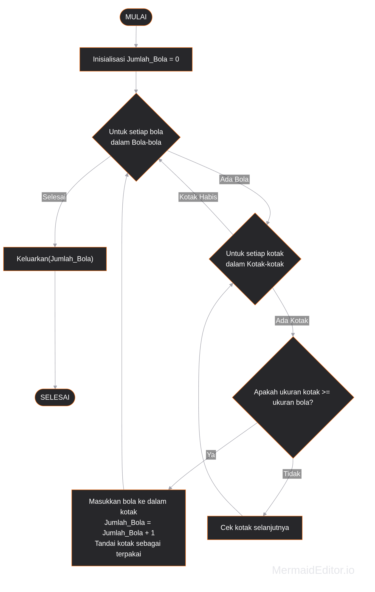
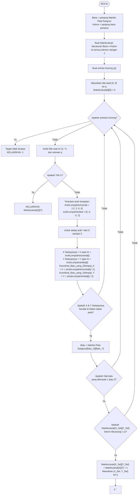

## SOAL 1 Mengisi Kotak

# Observasi
1. Jika kita memerhatikan gambar di soal, jumlah bola yang tersedia 12 buah. Sementara itu, jumlah kotak yang tersedia hanya 11. Artiyna jumlah maksimal bola yang kita dapat masukkan hanyalah X <= 11. 
2. Kita bisa masukkan bola dalam kotak dengan 2 strategi utama. Pertama masukan sesuai dengan ukuran mereka, bola kecil akan dimasukkan ke kotak kecil dan seterusnya. Kedua kita menggunakan strategi _Greedy_, dimana saat kita temukan kotak yang lebih besar daribola yang kita ambil saat ini langsung dimasukkan.

Kalau menggunakan strategi _greedy_, kita bisa memasukkan 10 bola. Jadi kita harus membuat algoritma _greedy_

## Pseudocode

 ```pseudocode
Mencari_Jumlah_Bola_Maksima(Bola-bola, Kotak-kotak) {

Untuk setiap anggota bola dari bola-bola cek setiap kotak dari Kotak-kotak {
                Jika ukuran kotak >= ukuran bola, masukan bola  
                Jumlah bola + 1

                Jika tidak, cek kotak selanjutnya
  }

Keluarkan(Jumlah Bola)

}
 ```




## SOAL 2 Kanguru Pelompat

# Observasi 
Bayangkan jalur yang dapat dilalui oleh kanguru sebagai matriks. Dimana setiap dinding di representasikan dengan angka 0 (tidak ada bata), 1 (1 bata), 2 (2 bata), 3 (3 bata), dan # (air) tidak bisa dilalui


 ```
0 1 0 1 0 1 0 1 0
1 # 2 # 3 # 3 # 1
0 3 0 1 0 1 0 2 0
3 # 3 # 2 # 2 # 1
0 1 0 2 0 1 0 2 0
2 # 2 # 1 # 3 # 3
0 3 0 2 0 2 0 1 0
3 # 3 # 2 # 2 # 2
0 1 0 1 0 1 0 3 X
```


Dimana X adalah titik akhir.

Kita bisa menemukan jumlah lompatan minimal dengan menggunakan algoritma BFS (Breadth First Search). BFS akan bergerak dari level ke level mengecek semua arah kemudian mengeluarkan langkah minimal.
Mengapa kita menggunakan BFS? BFS secara metematika akan mengelurkan nilai terkecil saat menemukan path dari titik mulai ke titik akhir.


 ```pseudocode
Cari_Lompatan_Minimal (Matriks Peta Kanguru) {

  MatriksJarak = Matriks 2D sebesar Matriks Peta Kanguru yang diisi -1
  q = queueu kosong

  Masukan titik awal (0, 0) ke q
  MatriksJarak[0][0] = 0

  ArahLompatHorizontal = [Kiri, Kanan, 0, 0]
  ArahLompatVertikal = [0,0, Kiri, Kanan]

  Selama q belum kosong {

  Ambil titik saat ini dari q
  
  Jika X ditemukan {
    keluarkan(MatriksJarak[X saat ini][Y saat ini])
  }

  Untuk i dari 0 sampai 3 {
  
  X Selanjutnya = X saat ini + ArahLompatHorizontal[i]
  Y Selanjutnya = Y saat ini + ArahLompatVertikal[i]

  Koordinat_Batu_yang_Dilompat_X = X saat ini + (ArahLompatHorizontal[i]/2)
  Koordinat_Batu_yang_Dilompat_Y = Y saat ini + (AraahLompatVertikal[i]/2)

  Jika Matriks Peta Kanguru [Koordinat_Batu_yang_Dilompat_X][Koordinat_Batu_yang_Dilompat_Y] == 1 batu atau 2 batu
      {
          Jika Matriks Peta Kanguru belum dikunjungi
            {
                MatriksJarak[X Selanjutnya][Y Selanjutnya] = MatriksJarak[X saat ini][Y saat ini] + 1
            }

        }

    }
  }
}
 ```

### Flowchart




