# SOAL 1

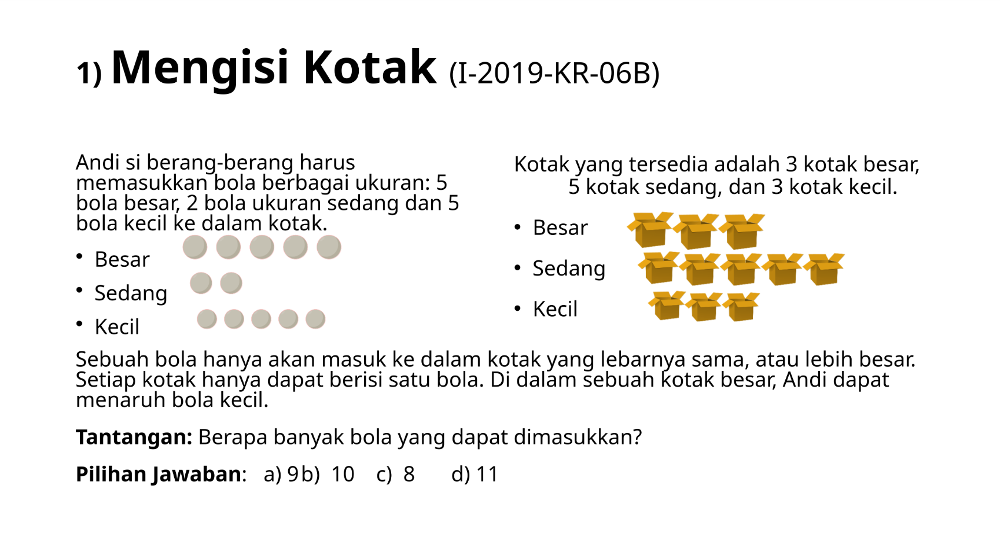

## Observasi
1. Jika kita memerhatikan gambar di soal, jumlah bola yang tersedia 12 buah. Sementara itu, jumlah kotak yang tersedia hanya 11. Artiyna jumlah maksimal bola yang kita dapat masukkan hanyalah X <= 11. 
2. Kita bisa masukkan bola dalam kotak dengan 2 strategi utama. Pertama masukan sesuai dengan ukuran mereka, bola kecil akan dimasukkan ke kotak kecil dan seterusnya. Kedua kita menggunakan strategi _Greedy_, dimana saat kita temukan kotak yang lebih besar daribola yang kita ambil saat ini langsung dimasukkan.

Kalau menggunakan strategi _greedy_, kita bisa memasukkan 10 bola. Jadi kita harus membuat algoritma _greedy_

## Pseudocode dan Flowchart

 ```pseudocode
Mencari_Jumlah_Bola_Maksima(Bola-bola, Kotak-kotak) {

Untuk setiap anggota bola dari bola-bola cek setiap kotak dari Kotak-kotak {
                Jika ukuran kotak >= ukuran bola, masukan bola  
                Jumlah bola + 1

                Jika tidak, cek kotak selanjutnya
  }

Keluarkan(Jumlah Bola)

}
 ```


# SOAL 2

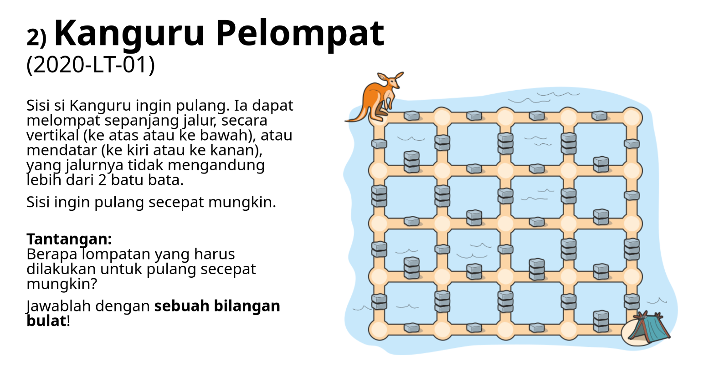

## Observasi 
Bayangkan jalur yang dapat dilalui oleh kanguru sebagai matriks. Dimana setiap dinding di representasikan dengan angka 0 (tidak ada bata), 1 (1 bata), 2 (2 bata), 3 (3 bata), dan # (air) tidak bisa dilalui


 ```
0 1 0 1 0 1 0 1 0
1 # 2 # 3 # 3 # 1
0 3 0 1 0 1 0 2 0
3 # 3 # 2 # 2 # 1
0 1 0 2 0 1 0 2 0
2 # 2 # 1 # 3 # 3
0 3 0 2 0 2 0 1 0
3 # 3 # 2 # 2 # 2
0 1 0 1 0 1 0 3 X
```


Dimana X adalah titik akhir.

Kita bisa menemukan jumlah lompatan minimal dengan menggunakan algoritma BFS (Breadth First Search). BFS akan bergerak dari level ke level mengecek semua arah kemudian mengeluarkan langkah minimal.
Mengapa kita menggunakan BFS? BFS secara metematika akan mengelurkan nilai terkecil saat menemukan path dari titik mulai ke titik akhir.

## Pseudocode dan Flowchart

 ```pseudocode
Cari_Lompatan_Minimal (Matriks Peta Kanguru) {

  MatriksJarak = Matriks 2D sebesar Matriks Peta Kanguru yang diisi -1
  q = queueu kosong

  Masukan titik awal (0, 0) ke q
  MatriksJarak[0][0] = 0

  ArahLompatHorizontal = [Kiri, Kanan, 0, 0]
  ArahLompatVertikal = [0,0, Kiri, Kanan]

  Selama q belum kosong {

  Ambil titik saat ini dari q
  
  Jika X ditemukan {
    keluarkan(MatriksJarak[X saat ini][Y saat ini])
  }

  Untuk i dari 0 sampai 3 {
  
  X Selanjutnya = X saat ini + ArahLompatHorizontal[i]
  Y Selanjutnya = Y saat ini + ArahLompatVertikal[i]

  Koordinat_Batu_yang_Dilompat_X = X saat ini + (ArahLompatHorizontal[i]/2)
  Koordinat_Batu_yang_Dilompat_Y = Y saat ini + (AraahLompatVertikal[i]/2)

  Jika Matriks Peta Kanguru [Koordinat_Batu_yang_Dilompat_X][Koordinat_Batu_yang_Dilompat_Y] == 1 batu atau 2 batu
      {
          Jika Matriks Peta Kanguru belum dikunjungi
            {
                MatriksJarak[X Selanjutnya][Y Selanjutnya] = MatriksJarak[X saat ini][Y saat ini] + 1
            }

        }

    }
  }
}
 ```

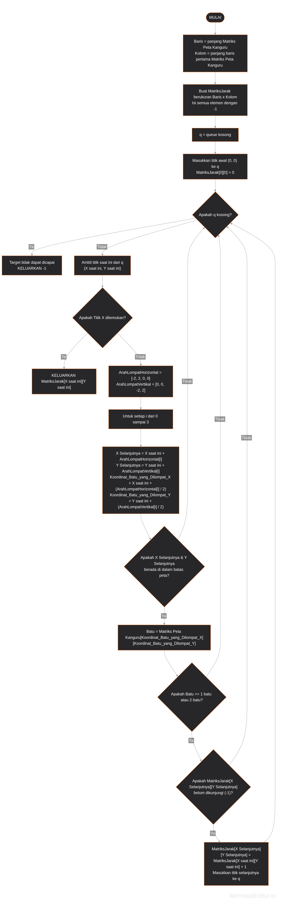

# SOAl 3

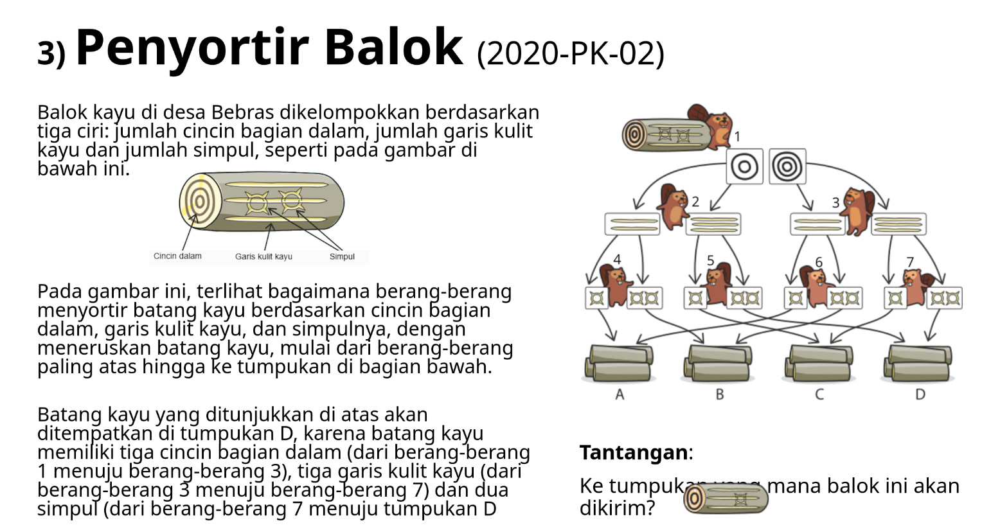

## Observasi
Dalam soal ini kita hanya perlu mengkategorikan sebuah input atau objek untuk masuk ke sebuah penampungan. Untuk memudahkan pengerjaan soal, saya akan menggunakan array sebagai penampung benda. Dari sana kita hanya perlu membuat fungsi yang memfilter balok kayu dan memasukkannya ke array benar.

Perhatikan bahwa setiap ciri dari kayu hanya memiliki 2 kemungkinan. Di komputer kita dapat memodelkan ini sebagai true and false. Jadi misalnya 2 cincin dalam menjadi true dan 3 cincin dalam false.
Kita hanya perlu membuat 4 array yang memiliki 3 input true atau false untuk setiap ciri.

Asumskikan jenis yang memiliki jumalah paling sedikit dalam kategorinya adalah true.
Ex : Cincin 2 (true), Cincin 3 (false)

Maka kita bisa melihat kategorisasi setiap array berdasarkan gambar sebagai berikut :

| Cincin Dalam | Garis Kulit | Jumlah Simpul | Array |
|--------------|-------------|---------------|-------|
| True         | True        | True          | A     |
| False        | False       | False         | D     |
| True         | False       | False         | D     |
| True         | True        | False         | B     |
| False        | True        | False         | B     |
| True         | False       | True          | C     |
| False        | False       | True          | C     |
| False        | True        | True          | A     |

Perhatikan bahwa setiap garis kulit dan jumlah simpul yang sama dalam sebuah objek kayu (Ex : GK (true), JS (true)) masuk ke dalam array yang sama. Apa artinya? Cincin dalam tidak berpengaruh sama sekali, maka dari itu kita bisa menyerdehanakan tabel menjadi :

| Garis Kulit (Bit 1) | Jumlah Simpul (Bit 0) | Binary | Integer | Target Array |
| :--- | :--- | :--- | :--- | :--- |
| False | False | `00` | `0` | **D** |
| False | True | `01` | `1` | **C** |
| True | False | `10` | `2` | **B** |
| True | True | `11` | `3` | **A** |

## Pseudocode dan Flowchart
```Pseudocode
Penyortir_Balok(Balok Kayu) {

  Indeks_Array = (BalokKayu.Garis_Kulit di ubah ke biner dan di shift ke kiri) + (BalokKayu.Jumlah_Simpul diubah ke biner)

  Kategorisasi_Array = [Array D, Array C, Array B, Array A]

  Masukkan Balok Kayu dalam array Kategorisasi_Array[Indeks_Array] 

}
```

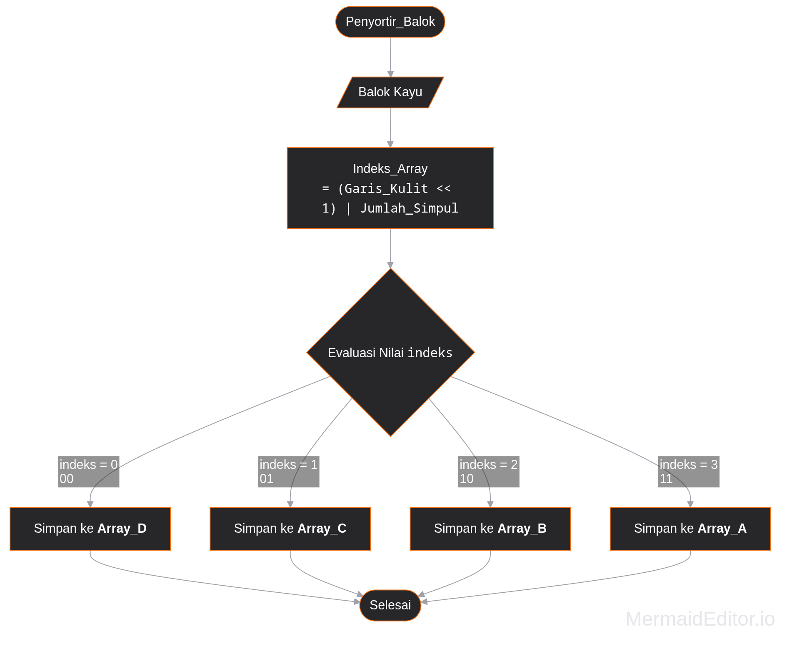

# SOAL 4

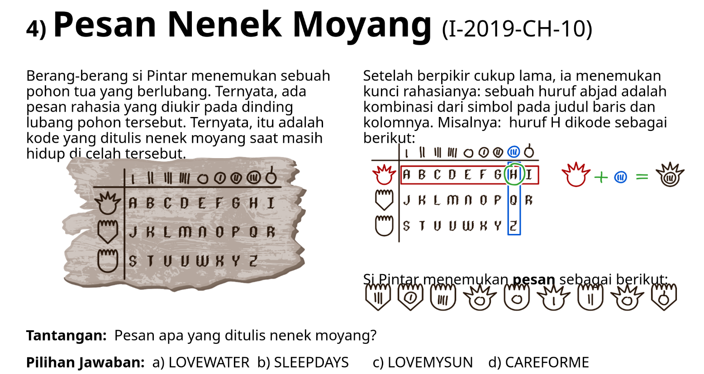

## Observasi

Perhatikan dalam tabel kode sususanannya seperti sebuah matriks. Kita bisa memetakan tabel tersebut menjadi sebuah matriks 3X9. Dalam program kita hanya perlu merepresntasikan setiap string menjadi sebuah karakter misalnya kepala bulat dan rambut runcing adalah A. Gambar kepala adalah koordinat X dan angka adalah Y Setelah itu, kita tinggal memasukan semua input dan mendapat pesan rahasia. 

## Pseudocode dan Flowchart
```pseudocode
Untuk semua gambar dari gambar-gambar {
    Translasi_Kode(Gambar_Kepala, Gambar_Angka, Tabel_Kode_Dalam_Matriks, Tabel_Translasi_Gambar_Ke_Angka) {

        Koordinat_X = Tabel_Translasi_Gambar_Ke_Angka[Gambar_Kepala];
        Koorinat_Y = Tabel_Translasi_Gambar_Ke_Angka[Gambar_Angka];

        Keluarkan(Tabel_Kode_Dalam_Matriks[Koordinat_X][Koorinat_Y]) 

  }
}
```

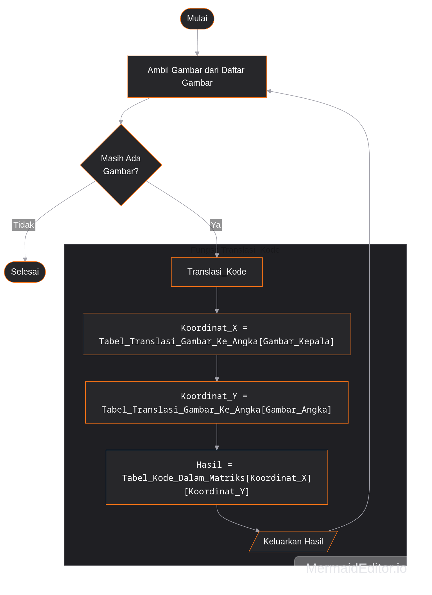

# Soal 5
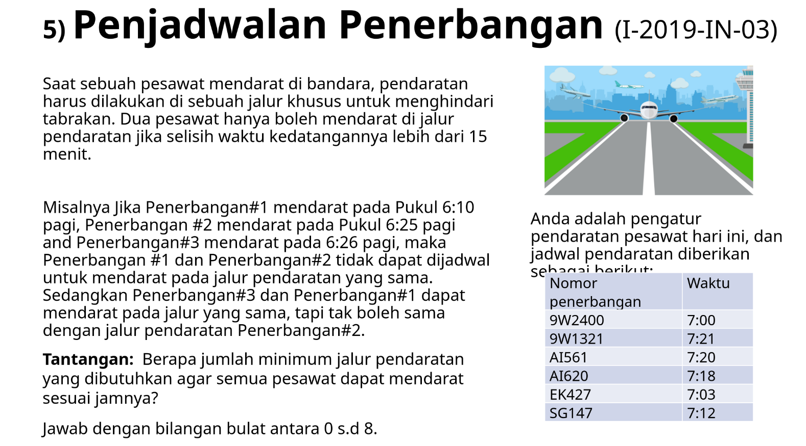

## Observasi

1. Untuk menyelesaikan soal ini, kita harus kembali menggunakan algoritma _greedy_, dimana setiap kali ada jalur pesawat yang masih kosong (selang waktu >15 menit), jalur pesawat tersebut langsung digunakan oleh pesawat yang datang. Jalur yang dipakai akan disimpan dalam array Jalur_Pesawat_Terpakai.
2. Kita harus memiliki standar waktu yang sama untuk setiap jam datang. Dalam soal aku akan menghitung jam dengan hitungan setelah tengah malam. Jadi misalnya 07:00 berarti 420 menit setelah tengah malam.

| Waktu Kedatangan | Jalur Pesawat Terpakai | Cek Jalur Pendaratan yang Ada | Status `assigned` | Tindakan yang Diambil | Jalur Pesawat Terpakai Setelah Tindakan |
| :--- | :--- | :--- | :--- | :--- | :--- |
| **07:00** (420 menit) | `[]` (Kosong) | Belum ada jalur | Tetap `false` | Belum ada jalur -> **Buka Jalur 1** | `[420]` |
| **07:03** (423 menit) | `[420]` | Jalur 1: 423 - 420 = 3 menit (<= 15 menit, jalur masih sibuk) | Tetap `false` | Semua sibuk -> **Buka Jalur 2** | `[420, 423]` |
| **07:12** (432 menit) | `[420, 423]` | Jalur 1: 432 - 420 = 12 menit (sibuk)<br/>Jalur 2: 432 - 423 = 9 menit (sibuk) | Tetap `false` | Semua sibuk -> **Buka Jalur 3** | `[420, 423, 432]` |
| **07:18** (438 menit) | `[420, 423, 432]` | Jalur 1: 438 - 420 = 18 menit (> 15, jalur bebas) | Berubah ke `true` | Pakai lagi jalur 1 (ubah ke 438) | `[438, 423, 432]` |
| **07:20** (440 menit) | `[438, 423, 432]` | Jalur 1: 440 - 438 = 2 menit (sibuk)<br/>Jalur 2: 440 - 423 = 17 menit (> 15, jalur bebas) | Berubah ke `true` | Pakai lagi jalur 2 (ubah ke 440) | `[438, 440, 432]` |
| **07:21** (441 menit) | `[438, 440, 432]` | Jalur 1: 441 - 438 = 3 menit (sibuk)<br/>Jalur 2: 441 - 440 = 1 menit (sibuk)<br/>Jalur 3: 441 - 432 = 9 menit (sibuk) | Tetap `false` | Semua sibuk -> **Buka Jalur 4** | `[438, 440, 432, 441]` |

## Pseudocode dan Flowchart
```Pseudocode

Ubah_Ke_Menit_dari_Tengah_Malam(waktu) {
    Keluarkan (jam * 60) + menit
}

Hitung_Minimal_Jalur(Daftar_Penerbangan) {
    
  Daftar_Menit = Array  

  Untuk setiap waktu dalam Daftar_Penerbangan {
        Daftar_Menit.tambah(Ubah_Ke_Menit_dari_Tengah_Malam(waktu))
  }
    Urutkan(Daftar_Menit)
    
    Jalur_Pesawat_Terpakai = Array
    
    Untuk setiap kedatangan dalam Daftar_Menit {
        ditemukan_jalur = False
        
        Untuk semua Jalur_Pesawat_Terpakai{
            Jika (kedatangan - Jalur_Pesawat_Terpakai[i] > 15) {
                Jalur_Pesawat_Terpakai[i] = kedatangan
                ditemukan_jalur = True
                break
            }
        }
        
        Jika Tidak ditemukan_jalur{
            Jalur_Pesawat_Terpakai.tambah(kedatangan)
        }
  }
    Kembalikan Panjang(Jalur_Pesawat_Terpakai)
}
```

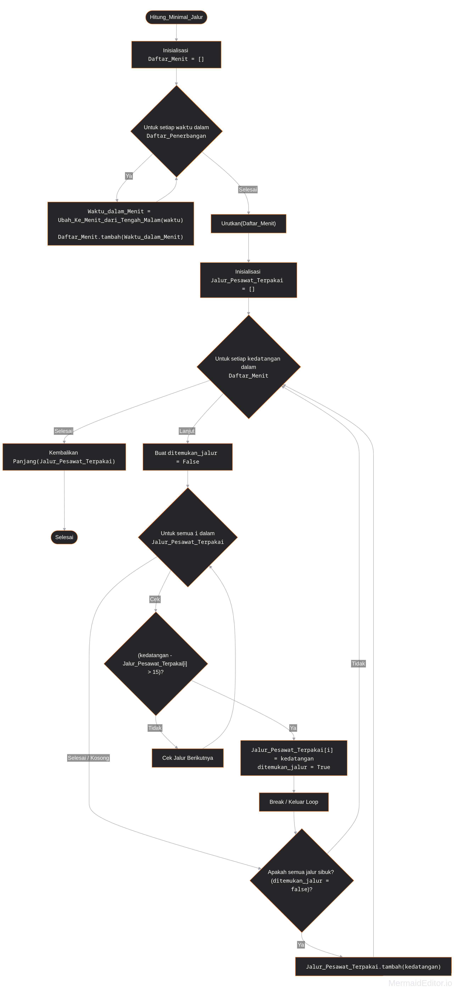

# Soal 6

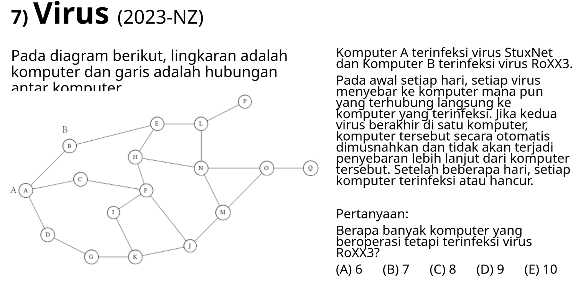

## Observasi

Untuk menyelesaikan soal ini kita harus mampu merepresentikan  gambar sebagai kode yang dapat dibaca oleh komputer. Saya aku melakukan hal tersebut dengan  membuat  sebuah _adjency list_. _Adjency list_ adalah cara merepresntasikan graf dengan menggunakan array. Index pada array, `adjList[i]`, merepresntasikan karakter apa yang sedang dicatat, bagian kedua, isinya, berisi koneksi yang dimiliki oleh karakter tersebut. Dari itu kita bisa  mendapat _adjency list_  sebagai berikut:

| Node | Indeks Array | Jumlah Tetangga (`degree`) | Daftar Tetangga (`adj[i]`) |
| :---: | :---: | :---: | :--- |
| **A** | 0 | 3 | B (1), C (2), D (3) |
| **B** | 1 | 2 | A (0), E (4) |
| **C** | 2 | 2 | A (0), F (5) |
| **D** | 3 | 2 | A (0), G (6) |
| **E** | 4 | 3 | B (1), H (7), L (11) |
| **F** | 5 | 4 | C (2), H (7), I (8), J (9) |
| **G** | 6 | 2 | D (3), K (10) |
| **H** | 7 | 3 | E (4), F (5), N (13) |
| **I** | 8 | 2 | F (5), K (10) |
| **J** | 9 | 3 | F (5), K (10), M (12) |
| **K** | 10 | 3 | G (6), I (8), J (9) |
| **L** | 11 | 3 | E (4), N (13), P (15) |
| **M** | 12 | 3 | J (9), N (13), O (14) |
| **N** | 13 | 4 | H (7), L (11), M (12), O (14) |
| **O** | 14 | 3 | M (12), N (13), Q (16) |
| **P** | 15 | 1 | L (11) |
| **Q** | 16 | 1 | O (14) |

---


Setelah itu, untuk menyelesaikan soal ini, kita perlu menggunakan algoritma BFS. BFS dalam konteks ini  artinya melakuukan simulasi anatara kedua virus  dalam adjency list. Hasil simulasi tersebut adalah sebagai berikut:

| Hari | Target Penyebaran StuxNet | Target Penyebaran RoXX3 | Konflik / Komputer Hancur | Status Komputer Beroperasi & Hancur |
| :---: | :--- | :--- | :--- | :--- |
| **0** | `A` *(Inisialisasi)* | `B` *(Inisialisasi)* | Tidak Ada | **StuxNet:** A<br/>**RoXX3:** B |
| **1** | Dari `A` &rarr; `B, C, D` | Dari `B` &rarr; `A, E` | `A` & `B` saling bertukar virus &rarr; **A dan B HANCUR** | **StuxNet:** C, D<br/>**RoXX3:** E<br/>**Hancur:** A, B |
| **2** | Dari `C, D` &rarr; `F, G` | Dari `E` &rarr; `H, L` | Tidak Ada | **StuxNet:** C, D, F, G<br/>**RoXX3:** E, H, L<br/>**Hancur:** A, B |
| **3** | Dari `F, G` &rarr; `H, I, J, K` | Dari `H, L` &rarr; `F, N, P` | `F` dan `H` menerima kedua virus bersamaan &rarr; **F dan H HANCUR** | **StuxNet:** C, D, G, I, J, K<br/>**RoXX3:** E, L, N, P<br/>**Hancur:** A, B, F, H |
| **4** | Dari `J` &rarr; `M` | Dari `N` &rarr; `M, O` | `M` menerima kedua virus bersamaan &rarr; **M HANCUR** | **StuxNet:** C, D, G, I, J, K<br/>**RoXX3:** E, L, N, O, P<br/>**Hancur:** A, B, F, H, M |
| **5** | *- Selesai -* | Dari `O` &rarr; `Q` | Tidak Ada | **StuxNet:** C, D, G, I, J, K *(6 node)*<br/>**RoXX3:** E, L, N, O, P, Q *(6 node)*<br/>**Hancur:** A, B, F, H, M *(5 node)* |

---

* **Terinfeksi RoXX3 (Aktif):** 6 Komputer (`E`, `L`, `N`, `O`, `P`, `Q`)
* **Terinfeksi StuxNet (Aktif):** 6 Komputer (`C`, `D`, `G`, `I`, `J`, `K`)
* **Hancur (Tidak Aktif):** 5 Komputer (`A`, `B`, `F`, `H`, `M`)

## Pseudocode  dan Flowchart
Kita implementasi BFS dari soal sebelumnya, tetapi sekarang ada 2 titik awal yang kita perhitungkan.

```Pseudocode
HitungKomputerRoXX3(adjList, totalNode) {
    
    Status = status[totalNode]
    
    Untuk i = 0 sampai totalNode - 1 {
        status[i] = KOSONG
    }

    Queue_S = Queue BFS StuxNet
    Queue_R = Queue BFS RoXX3

    status[0] = STUXNET
    Queue_S.push(0)

    status[1] = ROXX3
    Queue_R.push(1)

    Selama Queue_S tidak kosong ATAU Queue_R tidak kosong {
        Calon_S[totalNode] = {False}
        Calon_R[totalNode] = {False}

        Ulangi sebanyak jumlah elemen dalam Queue_S saat ini {
            node = Queue_S.pop()
            Jika status[node] == HANCUR { lanjutkan }

            Untuk setiap tetangga dalam adjList[node] {
                Jika status[tetangga] == KOSONG {
                    Calon_S[tetangga] = True
                }
            }
        }

        Ulangi sebanyak jumlah elemen dalam Queue_R saat ini {
            node = Queue_R.pop()
            Jika status[node] == HANCUR { lanjutkan }

            Untuk setiap tetangga dalam adjList[node] {
                Jika status[tetangga] == KOSONG {
                    Calon_R[tetangga] = True
                }
            }
        }

        Untuk node = 0 sampai totalNode - 1 {
            Jika status[node] != KOSONG { lanjutkan }

            Jika Calon_S[node] DAN Calon_R[node] {
                status[node] = HANCUR
            } 
            Lain halnya Jika Calon_S[node] {
                status[node] = STUXNET
                Queue_S.push(node)
            } 
            Lain halnya Jika Calon_R[node] {
                status[node] = ROXX3
                Queue_R.push(node)
            }
        }
    }

    jumlah_RoXX3 = 0
    Untuk i = 0 sampai totalNode - 1 {
        Jika status[i] == ROXX3 {
            jumlah_RoXX3++
        }
    }

    Kembalikan jumlah_RoXX3
}
```

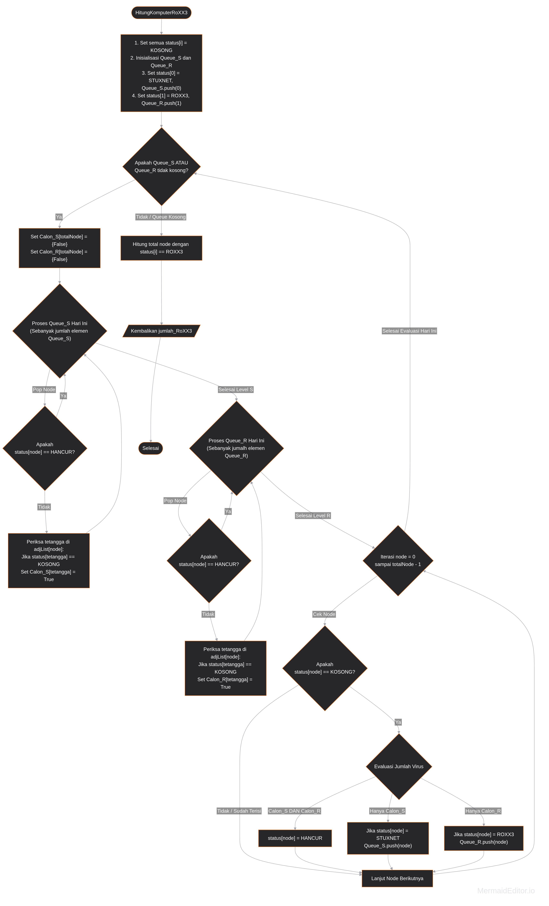

# Soal 7

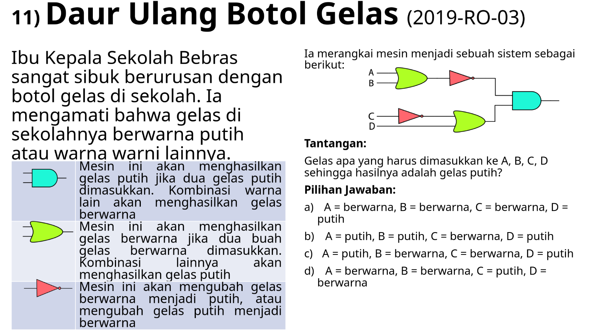

## Observasi
Misalkan bahwa gelas putih adalah 1 dan gelas warna sebagai 0. Dengan hal tersebut, kita bisa memikirkan gerbang-gerbang warna tersebut sebagai gerbang logika operasi.

1. Gerbang Toska
- Karena 1 bersama 1 menghasilkan 1 dan kombinasi selain itu adalah 0, maka gerbang tersebut adalah operasi logika  AND.

2. Gerbang Hijau Muda
- Karena 0 bersama 0 menghasilkan 0 dan lainnya menghasilkan 1, makar gerbang tersebut adalah operasi logika OR.

3. Gerbang Merah
- Operasi negasi atau NOT.

Kemudian untuk menyelesaikan soal ini kita harus melakukan simulasi semua kemungkinan menggunakan permutasi. Kita bisa melakukan menggunakan 4 looping. Dengan ini kita bisa menemukan segala kemungkinan yang mengasilkan putih.

## Pseudocode dan Flowchart
```Pseudocode
gerbangHijauMuda(x, y) {
 Kembalikan x || y
}

gerbangHijauToska(x, y) {
  Kembalikan x && y
}

gerbangMerah (x) {
  Kembalikan !x
}

Simulasi(A, B, C, D) {

HasilAtas = gerbangHijauMuda(A, B)
FinalAtas = gerbangMerah(HasilAtas)

NOTc = gerbangMerah(c)
HasilBawah = gerbangHijauMuda(NOTc, D)

HasilAkhir = gerbangHijauToska(HasilAtas, HasilBawah)

Kembalikan HasilAkhir

}

CariKombinasiPutih() {
    Untuk A = 0 sampai 1 {
        Untuk B = 0 sampai 1 {
            Untuk C = 0 sampai 1 {
                Untuk D = 0 sampai 1 {
                    Jika Simulasi(A, B, C, D) == 1 {
                        Keluarkan "Kombinasi Putih Ditemukan" 
                        Keluarkan Nilai A, B, C, D
                    }
                }
            }
        }
    }
}
```

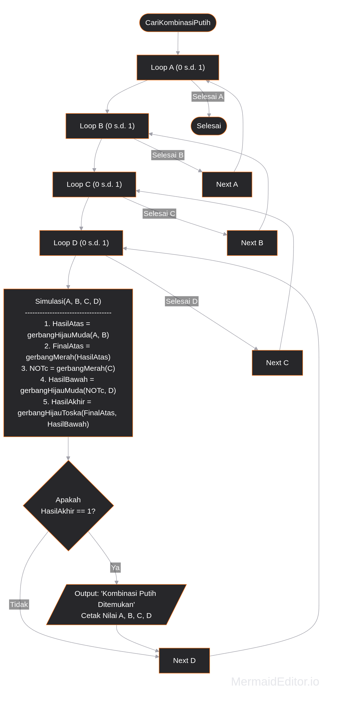

# Soal 8

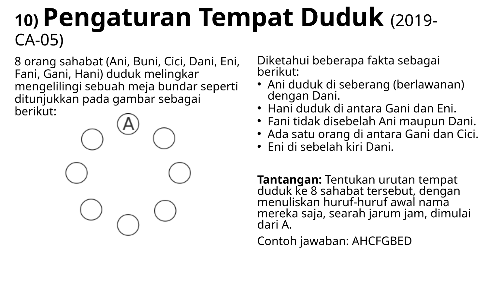

## Observasi 
Kita dapat merepresentikan meja dalam sebuah array dengan  8 annggota. Untuk merepresentikan perputaran kita dapat menggunakan operasi modulu (%). Jadi misalnya kita ingin mengecek orang sebelah kita, kita dapat menggumana `(posisi indeks + 1) % 8`. Ex : Posisi di 7 dan mau melihat sebelah kanannya. Maka (7 + 1) % 8 = 0, jadi cek array[0]. Setelah itu, seperti nomor sebelumnya, kita hanya perlu melakukan simulasi menggunakana permutasi sampai kombinasi yang benar didapatkan. Posisi Buni juga tidak diketahui jadi karena itu perlu simulasi. 

## Pseudocode dan Flowchart

```Pseudocode
CariPosisi(meja, target) {
    Untuk i = 0 sampai 7 {
        Jika meja[i] == target { Kembalikan i }
    }
    Kembalikan -1
}

CekValiditas(meja) {
    pAni = 0
    pDani = CariPosisi(meja, 'D')
    pHani = CariPosisi(meja, 'H')
    pGani = CariPosisi(meja, 'G')
    pEni = CariPosisi(meja, 'E')
    pFani = CariPosisi(meja, 'F')
    pCici = CariPosisi(meja, 'C')

    Jika pDani != 4 { Kembalikan Salah }

    syarat2 = (pHani == (pGani + 1) % 8 DAN pEni == (pHani + 1) % 8) ATAU 
              (pHani == (pEni + 1) % 8 DAN pGani == (pHani + 1) % 8)
    Jika TIDAK syarat2 { Kembalikan Salah }

    Jika pFani == 1 ATAU pFani == 7 ATAU pFani == 3 ATAU pFani == 5 { Kembalikan Salah }

    jarakGkeC = Abs(pGani- pCici)
    Jika jarakGkeC != 2 DAN jarakGkeC != 6 { Kembalikan Salah }

    Jika pEni != (pDani + 1) % 8 { Kembalikan Salah }

    Kembalikan Benar
}

CariKombinasi() {
    sahabat = {'B', 'C', 'D', 'E', 'F', 'G', 'H'}
    Urutkan(sahabat) 
    
    Ulangi {
        meja[0] = 'A'
        Untuk i = 0 sampai 6 {
            meja[i + 1] = sahabat[i]
        }

        Jika CekValiditas(meja) == Benar {
            Cetak anggota dalam meja
            Berhenti
        }
    } Selama (Permutasi(sahabat) Bisa)
}
```

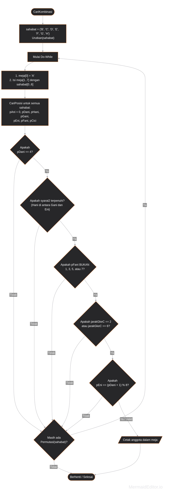
